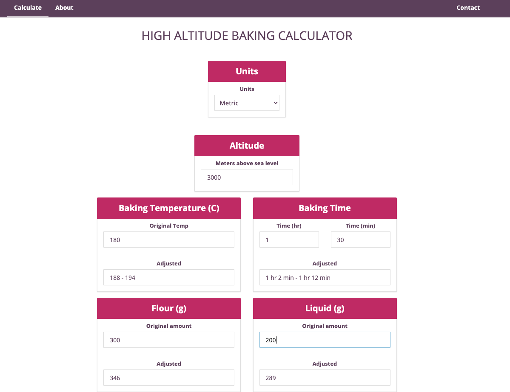
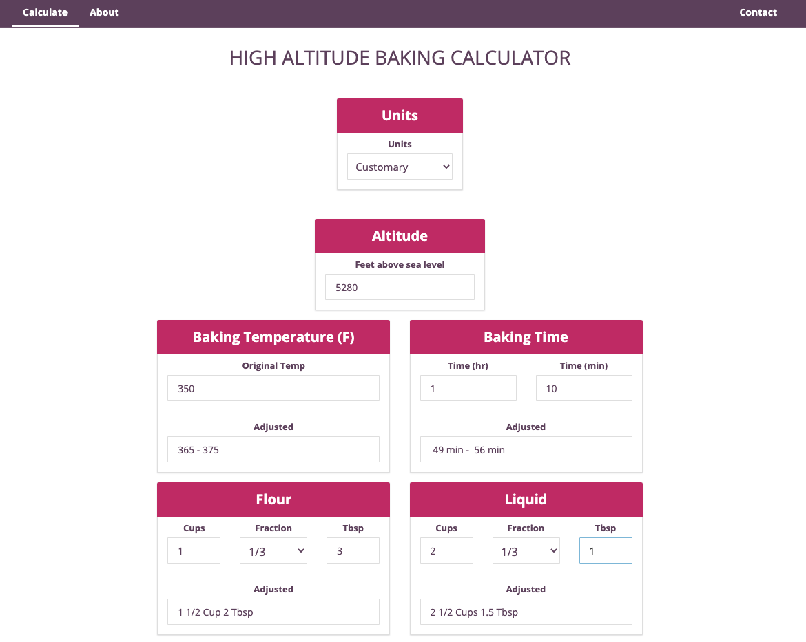

# High Altitude Baking Calculator

I was tired of making calculations by hand when baking at high altitudes. So I created this React application to do the work for me! This web app takes serious advantage of state management with Redux.

High Altitude Baking Calculator was built with [React](https://reactjs.org/) 

[Try it out for yourself!](https://highaltitudebaking-calculator.web.app/)

## The app supports both metric measurements...

  

## And customary measurements!

  

## What's under the hood

- **React**: v16.13.1
- **React Redux:** v7.2.1
- **Redux Thunk:** v2.3.0
- **React Router:** v5.2.0

- **Hosted on Firebase**

## Installation instructions

Make sure you have `npm` installed on your machine.

Once repository is downloaded, `cd` to top level directory and run:

`npm install`

Once installed, run:

`yarn start` or `npm start`

Have fun baking!

